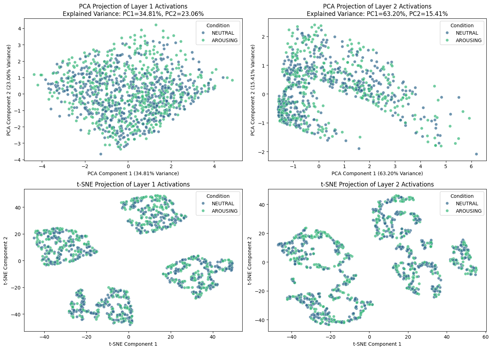
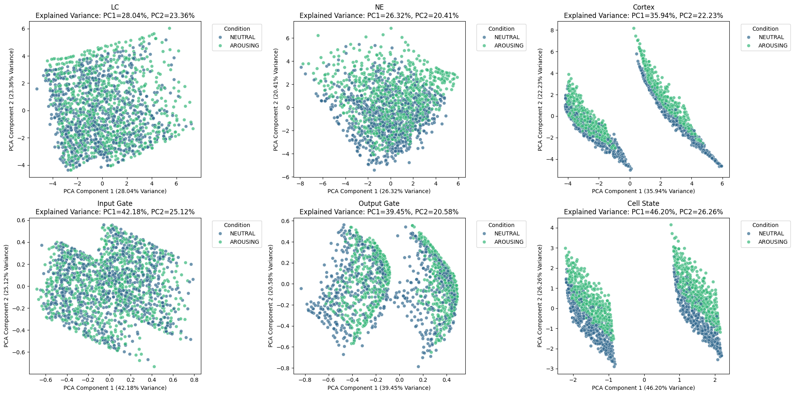

# Blue Dot Project: A Data Driven "Controller"
We want to study into the connection between Locus Coeruleus (LC)'s role in the generation of pathological anxiety and rumination as well as the effect it would cause on balancing between exploitation and exploration. To this end, we are creating a Locus Coeruleus rumination system in which we call it as the **B**lue **D**ot (LC in greek means little blue dot) **P**roject (BDP).
- [Meeting docs](https://docs.google.com/document/d/1740GxJ5xmIjUbWH8_RjYnuI5KNnZwGkvKQaM6hEzCLc/edit?tab=t.0#heading=h.e9mhf81r5r4b)
- [Computation formulation](https://www.overleaf.com/project/67a703b870287a1af3db3532)

## Three Data Driven Models:
We try to leverage neurosciecne behavior data related to LC-NE system to build a data driven model to fit and then manipulate the model component we have to give us a platform to operate on and play around with it (i.e. play around with the input and output and design the internal structure differently to see what would be the effects).

- First, we want to use **classical networks** (i.e feedforward fully connected neural networks, LSTM, ...) to fit the data, then try to correlate the concepts that these computation models have learned with concepts in neuroscience.
    - Maybe this can get us closer to the true process of information processing?

- Second, we want to use the the idea of building an **mechanistic model**:
    - We want more data, more neuroscience situations for this mechanistic model to fit to and demostrate its effects.
    - Very interpretable model as we control each "mechanistic" controller in seeing what might happen if we change something.
    - Can we add more RL flavor into the models?

- Third, we want to create a **fancy gadget model** for our classical network models to use. Instead of modifying the models directly, maybe we can take an approach that the Neural Turing Machine (NTM) did and try to create a gadget (in NTM it represents memory for read and write) and for us the gadget can be think of as teh LC-NE system.
    - This gadget it incorporates ideas in LC-NE and also ideas in cortex.
    - It need to be differentiable so everything can be back propoagted and we can see if the network can learn to use this controller (LC-NE system) to achieve the effect we see in the samples.

At last, we can use this fitteed model to prompt them under certain `experimental` conditions and see hwo they would react to as compares to rea behavior data from animals or human (i.e. the two lick test for rodent).

## Preliminary Results:
We provide an [sample notebook](https://github.com/KevinBian107/Blue-Dot-Project/blob/main/simulate.ipynb) for demostration purposes. Now  we have a sand-box that has been setup  to implement all kinds of cool neuroscience ideas that we can do.

| FF PCA clusters of different activation layers | LC-FF PCA clusters of different activations |
|--------------|---------------|
|  |  |

| LC-Gadget PCA clusters of different activations + hidden states  | LC-LSTM PCA clusters of different activations + hidden states |
|--------------|---------------|
|  |  |

Interestingly, we have found that the rpincipal component representation of our customized LCNE model seems to be more structured than the similar trained one (even better fitted model) of the feedforward network.

## Reference Literatures
Data Source:
- The [openneuro](https://openneuro.org/) is a very good source of data, we are specifically using this ["Locus coeruleus activity strengthens prioritized memories under arousal"](https://openneuro.org/datasets/ds002011/versions/1.0.0) dataset for now.
- Please do not push the data to GitHub, rather all work on it locally.

Literatures:
- [Mechanistic Model of Rumination & Cognition](https://onlinelibrary.wiley.com/doi/full/10.1111/tops.12318)
- [LC & Anxiety](https://pmc.ncbi.nlm.nih.gov/articles/PMC7479871/pdf/10.1177_2398212820930321.pdf)
- [Computational Perspective of LC](https://www.sciencedirect.com/science/article/pii/S2352154624000585)
- [Rumination Derails Reinforcement Learning With Possible Implications for Ineffective Behavior](https://pmc.ncbi.nlm.nih.gov/articles/PMC9354806/pdf/nihms-1741796.pdf)
- [LC-NE Drive RL](https://www.biorxiv.org/content/10.1101/2022.12.08.519670v1.full)
