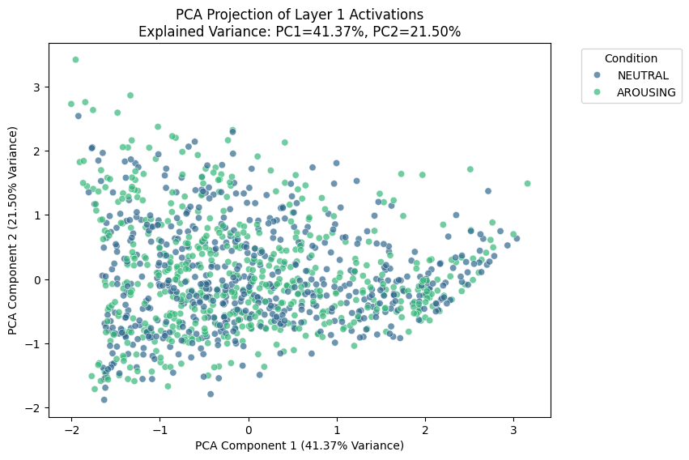
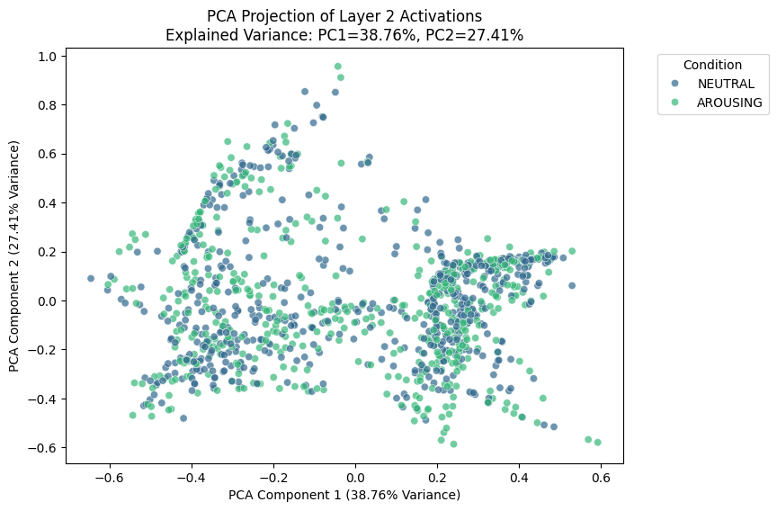
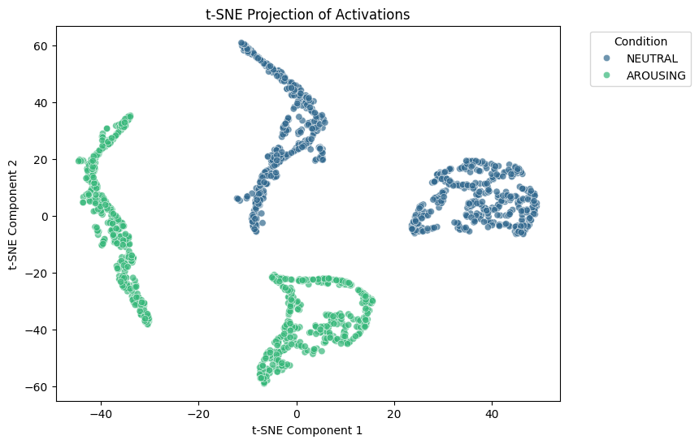

# Blue Dot Project: A Data Driven "Controller"
Study into the connection between Locus Coeruleus (LC)'s role in the generation of pathological anxiety and rumination as well as teh effect it would cause on balancing between exploitation and exploration. To this end, we are creating a Locus Coeruleus rumination system in which we call it as the **B**lue **D**ot (LC in greek means little blue dot) **P**roject (BDP).
- [Meeting docs](https://docs.google.com/document/d/1740GxJ5xmIjUbWH8_RjYnuI5KNnZwGkvKQaM6hEzCLc/edit?tab=t.0#heading=h.e9mhf81r5r4b)
- [Computation formulation](https://www.overleaf.com/project/67a703b870287a1af3db3532)

## A Mechanistic Model:
In a an pure-inference model, we can examine the output diufferences by changing output based on input or constructing the matrix a bit differently to see the effect. However, if we have some sort of data, we can build a data driven model to fit to the data and we can manipulate the model component we have to
- First better fit to the data
- Second give us a platform to operate on and play around with it.

We can first use classical networks to fit the data, then try to correlate the concepts that these computation models have learned with concepts in neuroscience. Maybe this can get us closer to the true process of information processing.

Then we use the the idea of using a **mechanistic model** to fit real neuroscience data.
- Let's get some behavior data that we can fit to -> then fit a mechanistic model with a loss -> then let's play around with the input and output and design the internal structure differently to see what would be the effects.
- We want more data, more neuroscience situations for this mechanistic model to fit to and demostrate its effects.
- Very interpretable model as we control each "mechanistic" controller in seeing what might happen if we change something.

## Fancy Gadget to Use:
Instead of modifying the models directly, maybe we can take an approach that the **Neural Turing Machine (NTM)** did and try to create a gadget (in NTM it represents memory for read and write) and for us the gadget can be think of as teh LC-NE system.
- It need to be differentiable so everything can be back propoagted and we can see if the network can learn to use this controller (LC-NE system) to achieve  teh effect we see in the samples.

## Preliminary Results:
We provide an [sample notebook](https://github.com/KevinBian107/Blue-Dot-Project/blob/main/simulate.ipynb)s for demostration purposes. Now  we have a sand-box that has been setup  to implement all kinds of cool neuroscience ideas that we can do:

Interestingly, we have found that the rpincipal component representation of our customized LCNE model seems to be more structured than the similar trained one (even better fitted model) of the feedforward network.

| FF-NN PCA Clusters Activation Layer 1 | FF-NN PCA Clusters Activation Layer 2 |
|--------------|---------------|
|  |  |

| LCNECortex Model PCA Clusters  | LCNECortex Model t-SNE Clusters |
|--------------|---------------|
|  |  |

## Data Sources:
The [openneuro](https://openneuro.org/) is a very good source of data, we are specifically using ["Locus coeruleus activity strengthens prioritized memories under arousal"](https://openneuro.org/datasets/ds002011/versions/1.0.0). Please do not push the data to GitHub, rather all work on it locally.

## Reference Literatures
- Mechanistic Model of Rumination & Cognition: https://onlinelibrary.wiley.com/doi/full/10.1111/tops.12318
- LC & Anxiety: https://pmc.ncbi.nlm.nih.gov/articles/PMC7479871/pdf/10.1177_2398212820930321.pdf 
- Computational Perspective of LC: https://www.sciencedirect.com/science/article/pii/S2352154624000585 
- Rumination Derails Reinforcement Learning With Possible Implications for Ineffective Behavior: https://pmc.ncbi.nlm.nih.gov/articles/PMC9354806/pdf/nihms-1741796.pdf 
- LC-NE Drive RL: https://www.biorxiv.org/content/10.1101/2022.12.08.519670v1.full 
